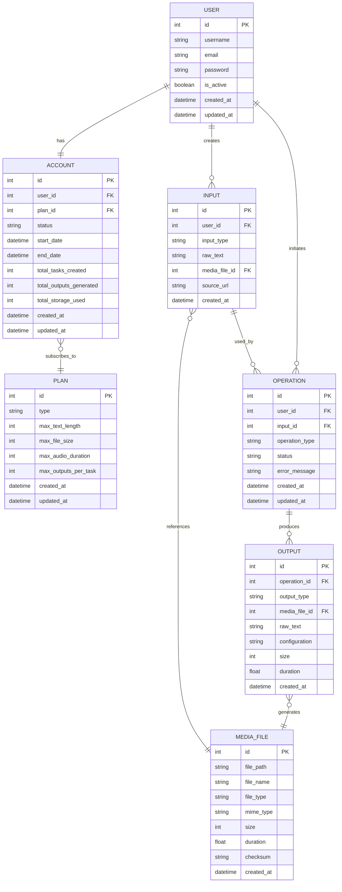

```mermaid
erDiagram

    USER {
        int id PK
        string username
        string email
        string password
        boolean is_active
        datetime created_at
        datetime updated_at
    }

    PLAN {
        int id PK
        string type
        int max_text_length
        int max_file_size
        int max_audio_duration
        int max_outputs_per_task
        datetime created_at
        datetime updated_at
    }

    ACCOUNT {
        int id PK
        int user_id FK
        int plan_id FK
        string status
        datetime start_date
        datetime end_date
        int total_tasks_created
        int total_outputs_generated
        int total_storage_used
        datetime created_at
        datetime updated_at
    }

    MEDIA_FILE {
        int id PK
        string file_path
        string file_name
        string file_type
        string mime_type
        int size
        float duration
        string checksum
        datetime created_at
    }

    INPUT {
        int id PK
        int user_id FK
        string input_type
        string raw_text
        int media_file_id FK
        string source_url
        datetime created_at
    }

    OPERATION {
        int id PK
        int user_id FK
        int input_id FK
        string operation_type
        string status
        string error_message
        datetime created_at
        datetime updated_at
    }

    OUTPUT {
        int id PK
        int operation_id FK
        string output_type
        int media_file_id FK
        string raw_text
        string configuration
        int size
        float duration
        datetime created_at
    }

    USER ||--|| ACCOUNT : has
    ACCOUNT }o--|| PLAN : subscribes_to

    USER ||--o{ INPUT : creates
    INPUT }o--|| MEDIA_FILE : references

    USER ||--o{ OPERATION : initiates
    INPUT ||--o{ OPERATION : used_by

    OPERATION ||--o{ OUTPUT : produces
    OUTPUT }o--|| MEDIA_FILE : generates
```