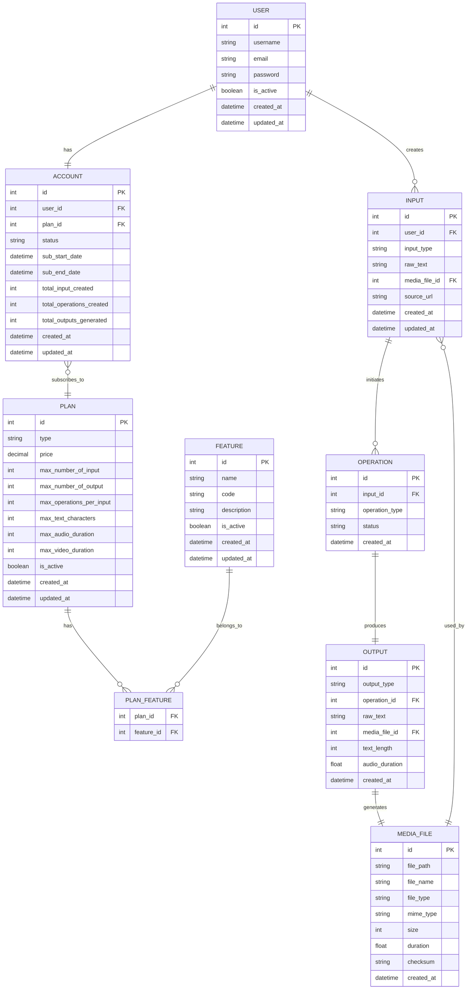

```mermaid
erDiagram

    USER {
        int id PK
        string username
        string email
        string password
        boolean is_active
        datetime created_at
        datetime updated_at
    }

    ACCOUNT {
        int id PK
        int user_id FK
        int plan_id FK
        string status
        datetime sub_start_date
        datetime sub_end_date
        int total_input_created
        int total_operations_created
        int total_outputs_generated
        datetime created_at
        datetime updated_at
    }

    PLAN {
        int id PK
        string type
        decimal price
        int max_number_of_input
        int max_number_of_output
        int max_operations_per_input
        int max_text_characters
        int max_audio_duration
        int max_video_duration
        boolean is_active
        datetime created_at
        datetime updated_at
    }

    FEATURE {
        int id PK
        string name
        string code
        string description
        boolean is_active
        datetime created_at
        datetime updated_at
    }

    PLAN_FEATURE {
        int plan_id FK
        int feature_id FK
    }

    MEDIA_FILE {
        int id PK
        string file_path
        string file_name
        string file_type
        string mime_type
        int size
        float duration
        string checksum
        datetime created_at
    }

    INPUT {
        int id PK
        int user_id FK
        string input_type
        string raw_text
        int media_file_id FK
        string source_url
        datetime created_at
        datetime updated_at
    }

    OPERATION {
        int id PK
        int input_id FK
        string operation_type
        string status
        datetime created_at
    }

    OUTPUT {
        int id PK
        string output_type
        int operation_id FK
        string raw_text
        int media_file_id FK
        int text_length
        float audio_duration
        datetime created_at
    }

    USER ||--|| ACCOUNT : has
    ACCOUNT }o--|| PLAN : subscribes_to

    PLAN ||--o{ PLAN_FEATURE : has
    FEATURE ||--o{ PLAN_FEATURE : belongs_to

    USER ||--o{ INPUT : creates

    INPUT ||--o{ OPERATION : initiates

    OPERATION ||--|| OUTPUT : produces
    OUTPUT || --|| MEDIA_FILE : generates
    MEDIA_FILE ||--o{ INPUT : used_by
```